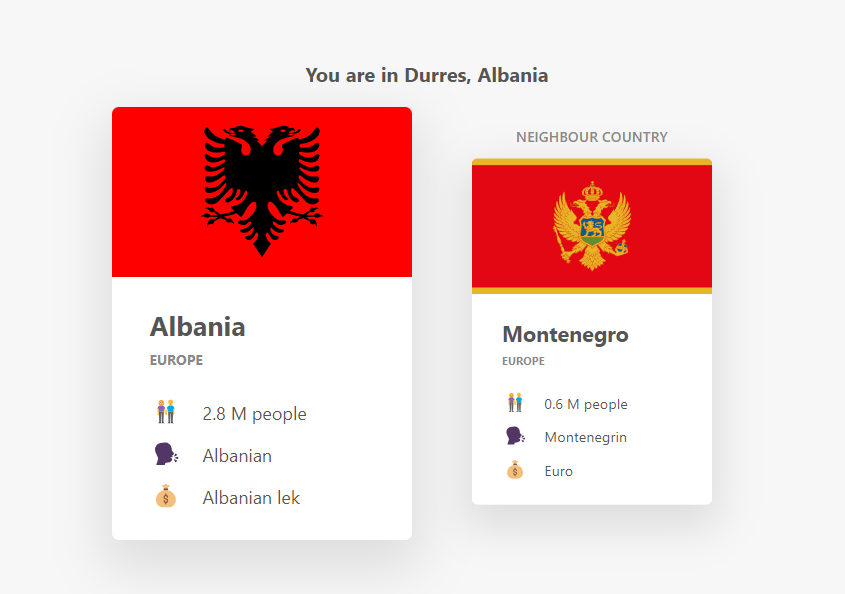

# WhereAmI

A web application that uses geolocation and country data APIs to determine the user's location and display information about their country and its neighbor.

  

    <a href="https://whereami-ester.netlify.app/">View Demo</a>
  

  
## Preview

## Features

- Uses the Geolocation API to get the user's current location.
- Reverse geocoding to determine the user's city and country.
- Fetches country data from the Rest Countries API.
- Displays information about the user's country, including flag, region, language, currency, and population.
- Also displays information about the user's country's neighbor.
- Handles errors and exceptions gracefully.

## How to Use

1. Click the "Where Am I?" button.
2. Allow the application to access your location.
3. Wait for the application to fetch and display the data.

## Technical Details

- Built using **HTML**, **CSS**, and **JavaScript**.
- Uses the Fetch API to make requests to the Geolocation API and Rest Countries API.
- Utilizes promises and async/await to handle asynchronous operations.
- Error handling is implemented using try-catch blocks, and error messages are displayed to the user.

## APIs Used

- [Geolocation API](https://developer.mozilla.org/en-US/docs/Web/API/Geolocation_API) (`navigator.geolocation`)
- [Rest Countries API](https://restcountries.com)
- [Geocode API](https://geocode.xyz)
